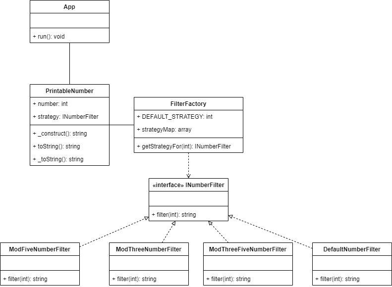

This project was created in response to the coding challenge for the Backend Developer position at Tac Tech.

# Context

Write a program that prints all the numbers from 1 to 100. However, for
multiples of 3, instead of the number, print "Falabella". For multiples of 5 print
"IT". For numbers which are multiples of both 3 and 5, print "Integraciones".
But here's the catch: you can use only one `if`. No multiple branches, ternary
operators or `else`.

## Requirements
* Only 1 if is permitted.
* You can't use `else`, `else if` or ternary
* Unit tests
* One git branch for the solution
* One git branch for the documentation

## Solution

This project combines the strategy and factory method patterns to provide a solution that doesn't
use IF statements and it's easily extensible for new cases.

The diagram that represents the structure of the code is the following:

